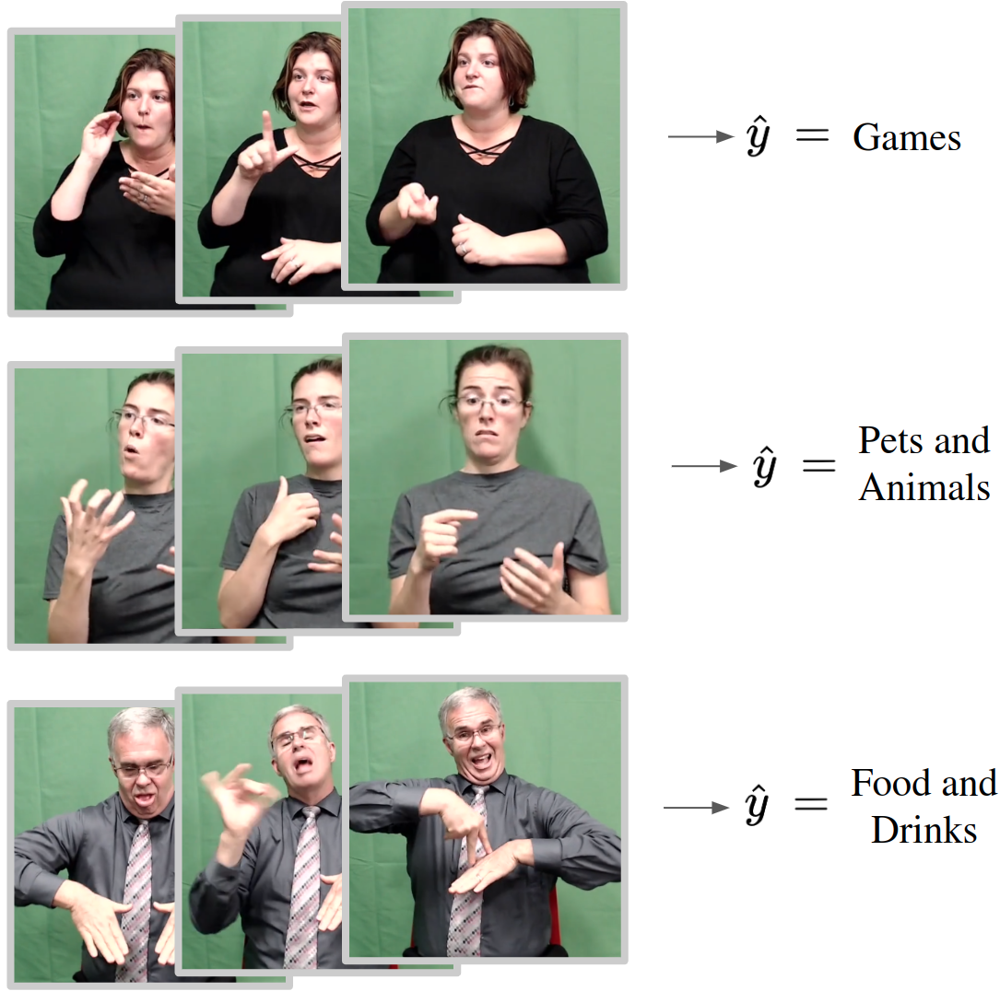

# Topic Detection in Continuous Sign Language Videos

<p align="center">
  
  <br />
  <br />
</p>

For instructions on how to run our training pipelines, go to `./examples/SL_topic_detection/` in this repo.

This repo is a fork of the original [Fairseq repository](https://github.com/facebookresearch/fairseq) that we extended for our work on Sign Language Topic Detection
--------------------------------------------------------------------------------

<p align="center">
  
  <br />
  <br />
  <a href="https://github.com/pytorch/fairseq/blob/main/LICENSE"></a>
  <a href="https://github.com/pytorch/fairseq/releases"></a>
  <a href="https://github.com/pytorch/fairseq/actions?query=workflow:build"></a>
  <a href="https://fairseq.readthedocs.io/en/latest/?badge=latest"></a>
</p>


Fairseq(-py) is a sequence modeling toolkit that allows researchers and
developers to train custom models for translation, summarization, language
modeling and other text generation tasks.

# License

fairseq(-py) is MIT-licensed.

# Citation to Fairseq

``` bibtex
@inproceedings{ott2019fairseq,
  title = {fairseq: A Fast, Extensible Toolkit for Sequence Modeling},
  author = {Myle Ott and Sergey Edunov and Alexei Baevski and Angela Fan and Sam Gross and Nathan Ng and David Grangier and Michael Auli},
  booktitle = {Proceedings of NAACL-HLT 2019: Demonstrations},
  year = {2019},
}
```
